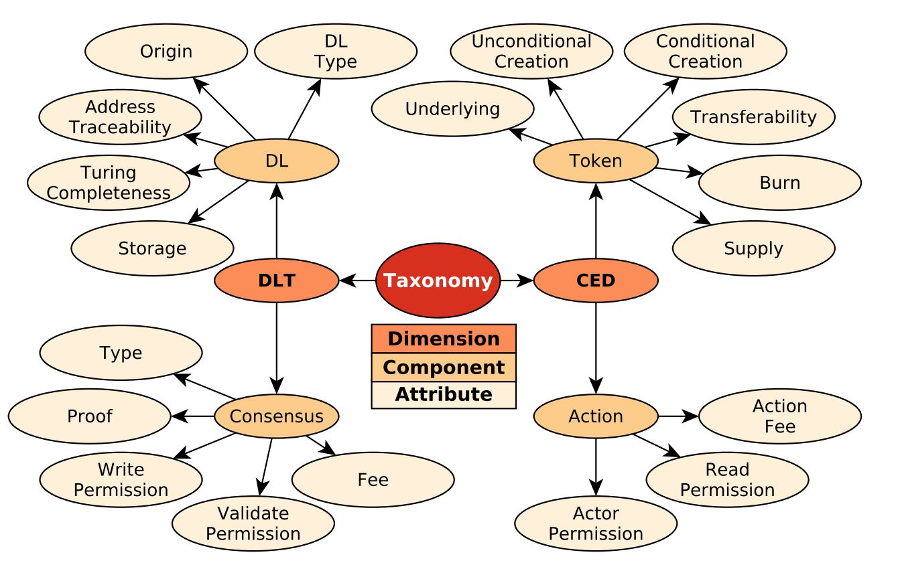
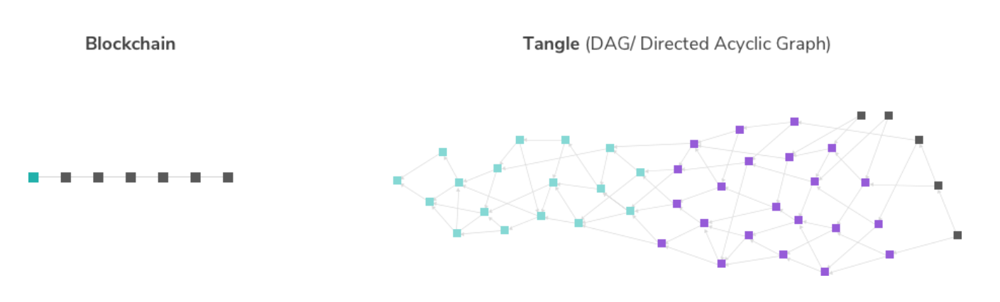
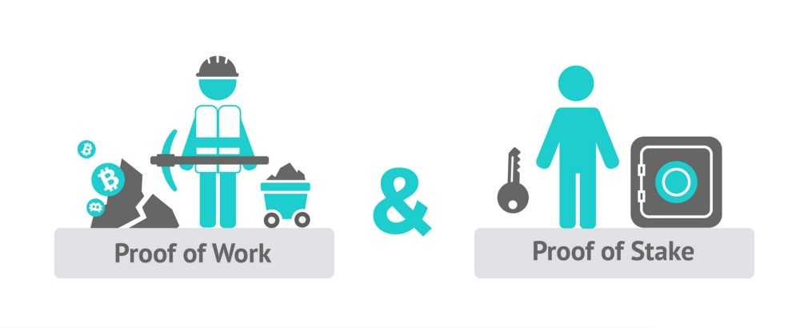

# Classification and Taxonomy of Blockchain Technologies
Blockchain technology is rapidly evolving and each day multiple new blockchain platforms emerge. Keeping track of all of these can be quite challenging, especially if there is no common classification between them. Creating this common classification (taxonomy) is not an easy task considering that taxonomy needs to be robust enough to cover all of the current technologies and support the future ones.

This article will describe the taxonomy created by Mark C. Ballandies, Marcus M. Dapp and Evangelos Pournaras, Ph.D. student and Post Docs from ETH Zurich. Their paper will be referenced at the end of the article. If you want to know more about the motivation and the process of creating this taxonomy I definitely encourage you to go read it.

## Taxonomy of Distributed Ledger Technologies (DLT)
The taxonomy described by the paper [1] consists of four components across two dimensions to classify DLT systems.
The first dimension concerns system design aspects related to the **distributed ledger technology (DLT)** - *distributed ledger (DL) component and consensus component*, while the second concerns **cryptoeconomic design aspects (CED)** - *action component and Token component*.

*Overview of the taxonomy, depicting the two dimensions of DLT and CED, its four components and 19 attributes (Image source [1])*

### Distributed Ledger Technology (DLT) Dimension
The DLT dimension consists of two components:
- Distributed ledger (DL) component and
- Consensus component

#### Distributed Ledger (DL) Component:
A distributed ledger is defined as a distributed data structure, whose entries are digital records of actions. In the Ethereum system, an entry in the data structure is called a block while in the IOTA system it is called a bundle.

The attributes of the distributed ledger component are:
- **type** (*blockchain, directed acyclic graph or other*)
> Type illustrates the data structure of the distributed ledger. 
> 
> The type has the characteristics:
> - *blockchain*, 
> - *directed acyclic graph (DAG)* and 
> - *other*. 
> 
> The blockchain is an immutable and append-only linked list, which has a total order of elements. It is the most known and used by a majority of systems (Bitcoin, Ethereum, Litecoin, etc.). In contrast to these systems, IOTA uses a directed acyclic graph. This data structure is no longer a linked list, but a directed graph with no cycles, leading to a partial order of elements. Moreover, Ripple neither uses a blockchain nor a DAG, but operates on other consensus based accounting mechanism.   
  
  *Blockchain vs DAG illustration (Image source: IOTA)*

- **origin** (*native, external or hybrid*)
> Origin defines the ownership of the distributed ledger. 
> 
> It has the characteristics: 
> - *native*, if the distributed ledger is maintained by and for the system itself or 
> - *external*, if the system uses a distributed ledger from another DLT system. 
> 
> Ethereum develops and maintains its distributed ledger natively. In contrast, Augur, OmiseGO, and Aragon do not maintain a native distributed ledger, they use Ethereum as an infrastructure.

- **address traceability** (*obfuscatable or linkable*)
> Shows the extent to which different transactions, originating from or incoming at the same chain identity, can be linked together. 
> 
> It has the characteristics:  
> - *obfuscatable*, if the distributed ledger has mechanisms in place to hide such links and 
> - *linkable* if links can be inferred with some computational effort. 

- **Turing completeness** (*yes or no*)
> Determines whether a Turing machine can be simulated by the distributed ledger. 
> 
> It has characteristics *yes* or *no*.
>
> Some DLs can execute Turing machines. Ethereum is an example of these. It allows for storage and execution of Turing complete smart contracts, in contrast to the Bitcoin blockchain.

- **storage** (*yes or no*)
> Determines if additional data can be stored on the distributed ledger besides default transaction information. 
> 
> The characteristics are: 
> - *yes*, if the data can be stored and 
> - *no*, if no additional data can be stored.

#### Consensus component
Consensus is the mechanism of writing entries to the distributed ledger, adhering to a set of rules that all participants of the consensus enforce when an entry containing transaction is validated.

The attributes of the consensus component are:
- **type** (*deterministic or probabilistic*)
> Shows whether the consensus is deterministic of probabilistic. 
> 
> Hence, its characteristics are: 
> - *deterministic*, if the consensus is found in a guaranteed finite amount of time or 
> - *probabilistic*, if the consensus is found with some uncertainty. 
> 
> Most DLT systems use the Nakamoto consensus, a Byzantine Fault Tolerance (BFT) algorithm. This type of algorithms tolerate a class of system failures that belong to the Byzantine Generals Problem. In particular, a consensus algorithm having this property prevents consensus participants to write a false transaction to the distributed ledger. In contrast to other BFT algorithms, the Nakamoto consensus is *probabilistic*. Ripple does not use a Nakamoto consensus for its algorithm. Its consensus is found in a guaranteed finite amount of time, hence making it *deterministic*. 

- **proof** (*PoW, PoS, hybrid or other*)
> Proof is evidence with which a consensus is found. 
> 
> It has the characteristics: 
> - *proof-of-work* (PoW), if it is delivered by utilizing the processing power of the computers, 
> - *proof-of-stake* (PoS), if it is delivered by voting linked to (economic) power in the system, 
> - *hybrid*, if it is a combination of the previous two or 
> - *other*, if another form of proof is required. 
> 
> Majority of DLT systems today utilize PoW but there is a general desire to move away from PoW as it has questionable sustainability in the long term. Ethereum is planning to migrate from PoW to PoS in the near future.
>
> 

- **write permission** (*public or restricted*)
> Illustrates who is allowed to write entries to the distributed ledger. 
> 
> The characteristics are: 
> - *restricted*, if participation is restricted or 
> - *public* otherwise. 
> 
> The Bitcoin and Ethereum consensus mechanism is public, it allows everyone having the computing power to participate. On the other hand, the consensus mechanism of Ripple is restricted, it has a few trusted institutions, which perform consensus, and hence not everyone can participate.

- **validator permission** (*public or restricted*)
> Shows who is allowed to validate claims before they are written to the distributed ledger. 
> 
> The characteristics are: 
> - *restricted*, if participation is restricted and 
> - *public* otherwise. 
> 
> In Bitcoin, the writers validate claims for correctness, utilizing the proof, before they write them to a block, hence the validator permission is also public. In contrast, in IOTA a central entity, the coordinator, validates transactions before they are collected in an entry and written to the directed acyclic graph.
- **fee** (*yes or no*)
> Shows whether participants of the consensus (writers and validators) are paid a fee for writing new entries to the distributed ledger. 
> 
> The characteristics are yes and no. 
> 
> In contrast to Bitcoin and Ethereum, where writers/validators are rewarded with fees, in IOTA the writers and validators receive no fees. In Ripple no fees are rewarded to the consensus participants, although the actors have to pay a fee.

### Cryptoeconomic design (CED) Dimension
The CED dimension consists of two components:
- Action component and
- Token component

#### Action component
An action is one or more real-life activities, which can be digitally represented by a DLT system as a transaction.

The attributes of the action component are:
- **Actor permission** (*public or restricted*)
> Illustrates who can perform an action. 
> 
> The characteristics are: 
> - *restricted*, if actors have to fulfill special requirements before performing actions in these systems or 
> - *public*, if anyone can perform actions. 
> 
> Bitcoin and Ethereum allow everyone to create a private key to send/receive token units, hence it has a public actor permission. Ripple uses restricted access rights. In order to comply with regulations (e.g. know-your-customer [KYC]), actors need to register.

- **Read permission** (*public or restricted*)
> Illustrates the scope of actors who can read contest of transactions from the distributed ledger. 
> 
> The characteristics are: 
> - *restricted*, if the permission is preconditioned, or 
> - *public*, if permission is not restricted. 
> 
> Most DLT systems have a public read access in the sense that everyone can read the content of occurred actions, e.g. the amount of transferred ethers. Privacy coins often restrict read access to actors of the transaction (e.g. Zcash), usually by making effort to hide the amount of transferred token units.
- **Fee** (*yes or no*)
> Shows whether the actor has to pay a fee for performing an action that is not related to consensus.  
> The characteristics are *yes* on *no*.   
> In Bitcoin no additional fee is required to perform an action, expect the one paid to the consensus participants. Also, Ripple requires actors to pay a fee per action, which is not paid to consensus participants, but is destroyed.

#### Token component
Token is a unit of value issued within a DLT system and which can be used as a medium of exchange or unit of account.

The attributes of the token component are:
- **Supply property** (*capped or uncapped*)
> Illustrates the total quantity of token units made available. 
> 
> The characteristics are: 
> - *capped*, if the total supply is bound by a finite number and 
> - *uncapped* otherwise. 
> 
> Under increasing demand for a currency, a capped supply can result in an appreciation of the currency and to deflation of prices denominated in it. Moreover, it can result in an appreciated exchange rate with other currencies, which in turn increase the stability of a DLT system. Bitcoin has a capped supply of 21 million units, whereas Ethereum does not have an upper limit.
- **Burn property** (*yes or no*)
> Illustrates whether token supply is reduced by removing token units.  
> The characteristics are *yes* or *no*.  
> Some DLT systems destroy token units in a process referred to as "burn". This decrease in money supply, while observing a constant demand results in an appreciation of the token units and hence, a better exchange rate with other currencies. For example in Ripple, paid fees are removed from the total supply and are not returned. In contrast, Bitcoin has no burn property.
> 
> <!--
> 
<i>Burn rate illustration</i>
 -->
- **Transferability** (*transferable or non-transferable*)
> Determines whether the ownership of a token unit can be changed. The characteristics are:
> - *transferable*, if the token can be transferred and
> - *non-transferable* otherwise.

- **Conditional creation** (*consensus, action, both, none*)
> Illustrates how the creation of new token units is bound to incentivize the consensus and/ or an action. 
> 
> The characteristics are: 
> - *consensus*, if creation is bound to the consensus, 
> - *action*, if the creation is bound to an action, 
> - *both*, if the creation is bound to the consensus as well as the action and 
> - *none* otherwise. 
> 
> In Bitcoin, new tokens are created by incentivizing the consensus mechanism. In Steemit, new steem token is created by incentivizing content creation on the platform (e.g. writing articles). 
> 
- **Unconditional creation** (*partial, all, none*)
> Illustrates the amount of new token units that are created independent of incentivizing the consensus or an action. 
> 
> The characteristics are: 
> - *partially*, if some tokens are created independently, 
> - *all*, if all tokens are created independently (e.g. 100 % pre-mined tokens) or 
> - *none* otherwise.    
>
> At the genesis of the Bitcoin system, no token units are previously mined and all tokens come into existence by incentivizing the consensus. On the other hand, all Ripple tokens are created during the genesis of the system.

- **Underlying** (*distributed ledger, consensus, action, token, physical asset, none*)
> Illustrates where the source of value lies and what is constitutes of. 
> 
> The characteristics are: 
> - *distributed ledger*, if the token gives access to the distributed ledger, e.g. if the token is needed in order to use the storage or computing capacity of the distributed ledger,
> - *consensus*, if the token gives access to the consensus mechanism, e.g. proof-of-stake,
> - *action*, if the token gives access to perform or receive actions or services in the DLT system,
> - *token*, if the token gives access to another token; 
> - *physical asset*, if the token gives access to goods or commodities external to the DLT system,
> - *none*, if the token has no underlying.

## Describing Popular Terms
Now that we described the taxonomy proposed by paper [1], we can try to describe popular terms using it.

| System Term    | Description                                                                             |
| :------------- | :-------------------------------------------------------------------------------------- |
| Blockchain     | distributed ledger component: *blockchain* type                                         |
| Permissioned   | consensus component: *restricted* write permission OR *restricted* validator permission |
| Permissionless | consensus component: *public* write permission AND *public* validator permission        |
| Public         | Permissionless DLT system AND action component: *public* actor permission               |
| Private        | Permissioned DLT system AND action component: *restricted* actor permission             |
| Privacy        | Public DLT system AND token component: *obfuscatable* traceability                      |

   

| Cryptoeconomic Term | Description                                                             |
| :------------------ | :---------------------------------------------------------------------- |
| Utility             | token component: *distributed ledger* underlying OR *action* underlying |
| Asset               | token component: *token* underlying OR *physical asset* underlying      |
| Payment             | token component: *yes* transferability                                  |

## Classification of DLT Systems

Bellow you see some of the popular DLT systems classified with the taxonomy described above. Only a couple of DLT systems will be classified in this article, if you want to see more classifications, please read the paper [1] referenced at the end of this article. There you will find classifications of 29 DLTs and detailed explanation of classifications.

Systems that have external origin do not maintain their own distributed ledger (DL). Hence they do not have the attributes that are DL dependant as they use DLs from other systems. For example, Storj uses Ethereum's DL so it does not have attributes such as address traceability, Turing completeness, storage, etc. as these attributes are in the distributed ledger technology dimension.  

### Classification according to the Distributed Ledger Component

| DLT System           |  Origin  |    Type    | Address Traceability | Turing Completeness | Storage |
| :------------------- | :------: | :--------: | :------------------: | :-----------------: | :-----: |
| Bitcoin              |  Native  | Blockchain |       Linkable       |         No          |   Yes   |
| Ethereum             |  Native  | Blockchain |       Linkable       |         Yes         |   Yes   |
| IOTA                 |  Native  |    DAG     |       Linkable       |         No          |   No    |
| Ripple               |  Native  |   Other    |       Linkable       |         No          |   Yes   |
| Hyperledger (Fabric) |  Native  |   Other    |       Linkable       |         Yes         |   Yes   |
| Storj                | External |     -      |          -           |          -          |    -    |
| Golem                | External |     -      |          -           |          -          |    -    |
| EOS                  |  Native  | Blockchain |       Linkable       |         Yes         |   Yes   |
| Litecoin             |  Native  | Blockchain |       Linkable       |         No          |   Yes   |
| Dash                 |  Native  | Blockchain |     Obfuscatable     |         No          |   Yes   |

### Classification according to the Consensus Component

| DLT System           | Consensus Type | Proof | Write Permission | Validator Permission |  Fee  |
| :------------------- | :------------: | :---: | :--------------: | :------------------: | :---: |
| Bitcoin              | Probabilistic  |  PoW  |      Public      |        Public        |  Yes  |
| Ethereum             | Probabilistic  |  PoW  |      Public      |        Public        |  Yes  |
| IOTA                 | Probabilistic  |  PoW  |      Public      |      Restricted      |  No   |
| Ripple               | Deterministic  | Other |    Restricted    |      Restricted      |  No   |
| Hyperledger (Fabric) | Deterministic  | Other |    Restricted    |      Restricted      |  No   |
| Storj                |       -        |   -   |        -         |          -           |   -   |
| Golem                |       -        |   -   |        -         |          -           |   -   |
| EOS                  | Deterministic  |  PoS  |    Restricted    |      Restricted      |  No   |
| Litecoin             | Probabilistic  |  PoW  |      Public      |        Public        |  Yes  |
| Dash                 | Probabilistic  |  PoW  |      Public      |        Public        |  Yes  |

### Classification according to the Action Component

| DLT System           | Actor Permission | Read Permission | Action Fee |
| :------------------- | :--------------: | :-------------: | :--------: |
| Bitcoin              |      Public      |     Public      |     No     |
| Ethereum             |      Public      |     Public      |     No     |
| IOTA                 |      Public      |     Public      |     No     |
| Ripple               |    Restricted    |   Restricted    |    Yes     |
| Hyperledger (Fabric) |    Restricted    |   Restricted    |     No     |
| Storj                |      Public      |     Public      |    Yes     |
| Golem                |      Public      |     Public      |    Yes     |
| EOS                  |      Public      |   Restricted    |     No     |
| Litecoin             |      Public      |     Public      |     No     |
| Dash                 |      Public      |     Public      |    Yes     |

### Classification according to the Token Component

| DLT System           | Token Name | Supply Property | Burn Property | Transferability | Conditional Creation | Unconditional Creation | Underlying |
| :------------------- | :--------: | :-------------: | :-----------: | :-------------: | :------------------: | :--------------------: | :--------: |
| Bitcoin              |  Bitcoin   |     Capped      |      No       |  Transferrable  |      Consensus       |          None          |     DL     |
| Ethereum             |   Ether    |    Uncapped     |      No       |  Transferrable  |      Consensus       |       Partially        |     DL     |
| IOTA                 |   MIOTA    |     Capped      |      No       |  Transferrable  |         None         |          All           |    None    |
| Ripple               |   Ripple   |     Capped      |      Yes      |  Transferrable  |         None         |          All           | DL, Action |
| Hyperledger (Fabric) |     -      |        -        |       -       |        -        |          -           |           -            |     -      |
| Storj                |   Storj    |     Capped      |      No       |  Transferrable  |         None         |          All           |   Action   |
| Golem                |    GNT     |     Capped      |      No       |  Transferrable  |         None         |          All           |   Action   |
| EOS                  |    EOS     |    Uncapped     |      No       |  Transferrable  |      Consensus       |       Partially        |     DL     |
| Litecoin             |  Litecoin  |     Capped      |      No       |  Transferrable  |      Consensus       |          None          |     DL     |
| Dash                 |    Dash    |     Capped      |      No       |  Transferrable  |         Both         |          None          | DL, Action |

## Conclusion
Taxonomy described in this article is comprehensive and robust enough to classify all of the current DLTs and should be robust enough to cover all of the current trends but it can be easily expanded and modified in the future is there is a need to do so.

## References
[1] Ballandies, Mark C., Marcus M. Dapp, and Evangelos Pournaras. "Decrypting Distributed Ledger Design-Taxonomy, Classification and Blockchain Community Evaluation." arXiv preprint arXiv:1811.03419 (2018).
